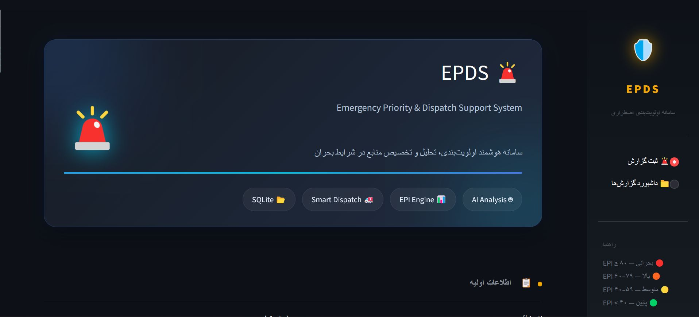
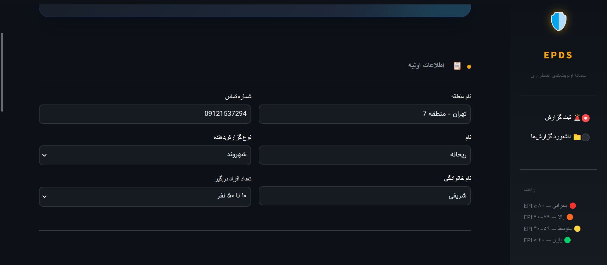
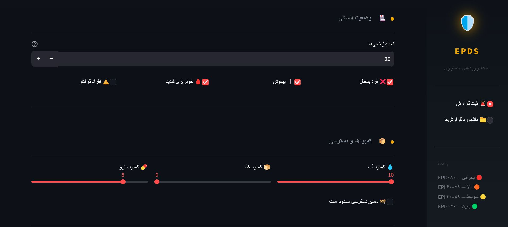
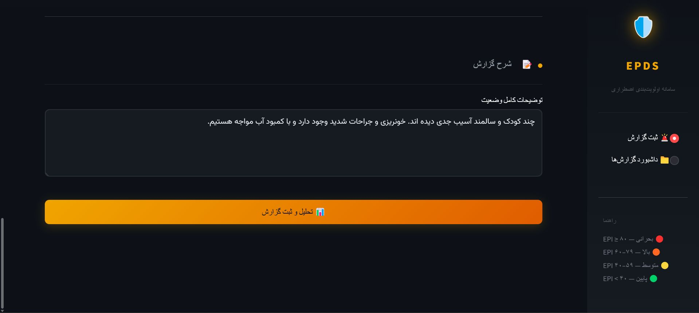
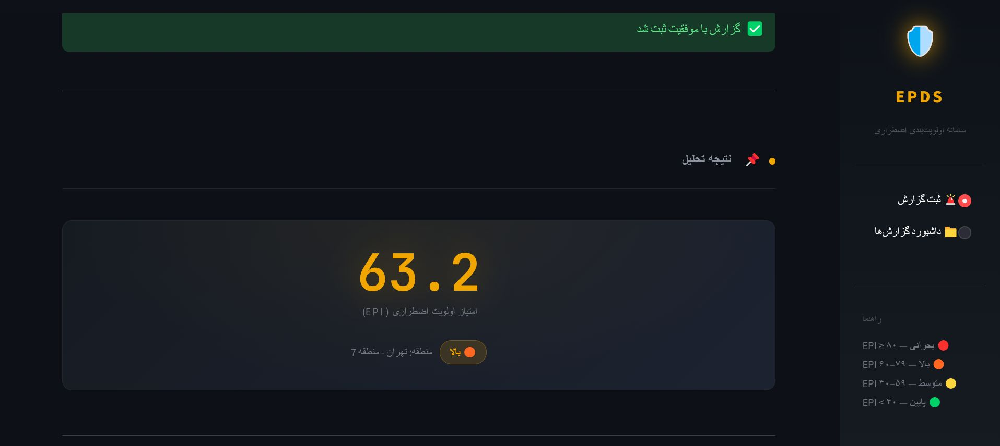
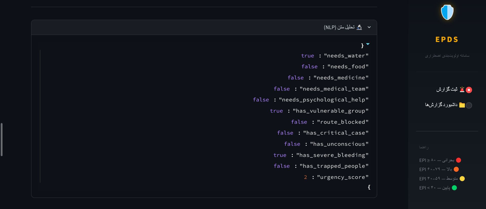
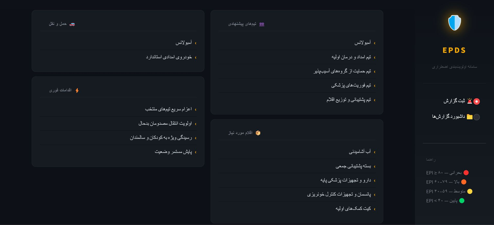
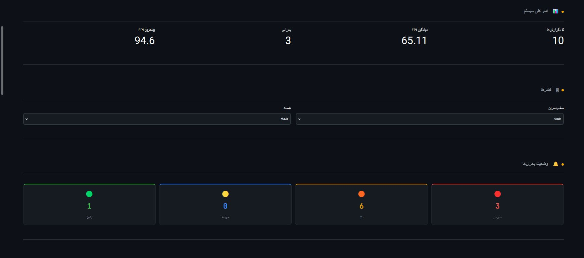
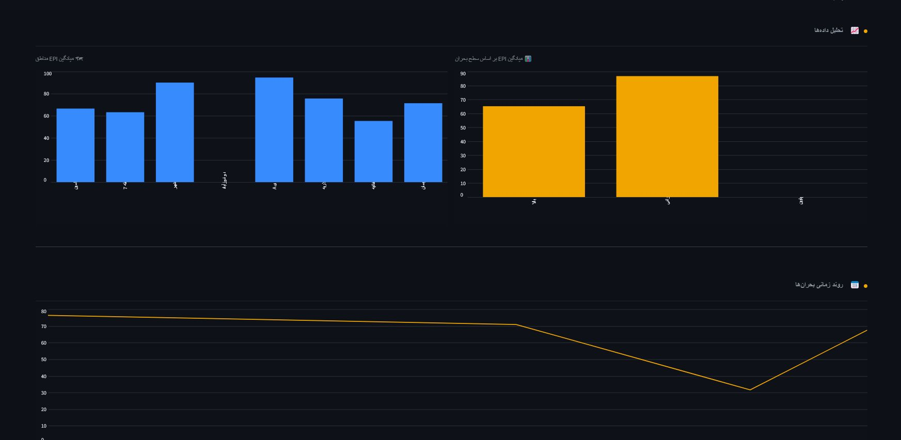
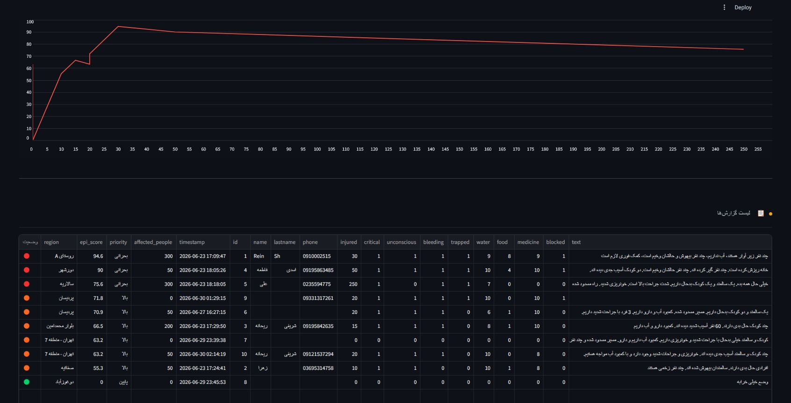

<div align="center">

# 🚨 Emergency Priority Decision System (EPDS)

### AI-Powered Emergency Prioritization & Decision Support Platform

An intelligent decision support system for analyzing emergency reports, calculating crisis priority, and recommending optimal rescue resources using Artificial Intelligence and Natural Language Processing.

---


---

### 📌 Smart Prioritization Saves Lives

*Transforming emergency reports into actionable rescue decisions.*

</div>

---

# 📖 Overview

Emergency Priority Decision System (EPDS) is an AI-assisted decision support platform designed to improve disaster response by automatically analyzing emergency reports submitted by citizens or rescue operators.

The system extracts critical information from textual reports, calculates an **Emergency Priority Index (EPI)**, classifies incidents into different urgency levels, and recommends the most appropriate emergency teams, equipment, transportation, and immediate operational actions.

Instead of replacing human decision-makers, EPDS assists emergency managers by providing fast, consistent, and explainable recommendations that help optimize rescue operations.

---

# 🎯 Objectives

* Reduce emergency response time
* Improve disaster resource allocation
* Prioritize incidents objectively
* Assist emergency operation centers
* Support rescue teams with AI-based recommendations
* Store reports for future monitoring and analysis

---

# ✨ Key Features

* 🤖 Persian Natural Language Processing (NLP)
* 📊 Emergency Priority Index (EPI) calculation
* 🚑 Intelligent rescue resource recommendation
* 🏥 Medical emergency detection
* 🚧 Route accessibility analysis
* 💧 Water, food and medicine shortage detection
* 👶 Vulnerable group identification
* 📈 Interactive analytical dashboard
* 💾 SQLite database integration
* 🌐 Modern Streamlit web interface

---

# 🧠 AI Workflow

```text
Emergency Report
        │
        ▼
Input Validation
        │
        ▼
Persian NLP Analysis
        │
        ▼
Feature Extraction
        │
        ▼
Emergency Priority Index (EPI)
        │
        ▼
Priority Classification
        │
        ▼
Resource Recommendation Engine
        │
        ▼
Database Storage
        │
        ▼
Management Dashboard
```

---

# 🏗️ System Architecture

```text
                +---------------------------+
                |     Emergency Reporter    |
                +-------------+-------------+
                              |
                              v
                  Streamlit Web Interface
                              |
              +---------------+----------------+
              |                                |
              v                                v
      Form Validation                 Persian NLP Module
                                              |
                                              v
                                   Information Extraction
                                              |
                                              v
                                  Emergency Priority Index
                                              |
                                              v
                             Intelligent Resource Matcher
                                              |
                                              v
                                   SQLite Database Storage
                                              |
                                              v
                                   Reports & Dashboard
```

---

# 📂 Project Structure

```text
Emergency-Priority-Decision-System/
│
├── app.py
├── requirements.txt
├── README.md
│
├── assets/
│   └── screenshots/
│       ├── 1.jpg
│       ├── 2.jpg
│       ├── ...
│       └── 10.jpg
│
├── modules/
│   ├── database.py
│   ├── epi.py
│   ├── matcher.py
│   ├── nlp.py
│   └── ...
│
└── data/
    ├── epds.db
    └── reports.csv
```

---

# ⚙️ Installation

## 1. Clone Repository

```bash
git clone https://github.com/Rainsh724/Emergency-Priority-Decision-System.git
```

## 2. Enter Project

```bash
cd Emergency-Priority-Decision-System
```

## 3. Install Requirements

```bash
pip install -r requirements.txt
```

## 4. Run

```bash
streamlit run app.py
```

---

# 🖥️ User Interface

The following screenshots illustrate different parts of the EPDS system.

## 🏠 Home Page



---

## 📝 Emergency Report Form






---

## 🚨 Emergency Priority Index (EPI)



---

## 🤖 NLP Analysis Result



---

## 🚑 Resource Recommendation



---

## 📊 Reports Dashboard



---

## 📈 Statistical Charts




## 🗄️ Database and Reports Details



---

# 🧩 Main Modules

## 📄 app.py

Main Streamlit application responsible for rendering the user interface, collecting emergency reports, displaying analytics, and coordinating all system modules.

---

## 🤖 nlp.py

Implements rule-based Persian Natural Language Processing for extracting emergency-related information such as injuries, trapped victims, shortages, urgency, and vulnerable groups.

---

## 📊 epi.py

Calculates the Emergency Priority Index (EPI) using weighted emergency indicators collected from both structured inputs and NLP analysis.

---

## 🚑 matcher.py

Generates intelligent recommendations including rescue teams, emergency supplies, transportation methods, and operational actions based on the calculated EPI.

---

## 💾 database.py

Handles SQLite database operations including report creation, retrieval, and dashboard integration.

---

---

# 🛠️ Technology Stack

| Category             | Technology     |
| -------------------- | -------------- |
| Programming Language | Python 3.12    |
| Web Framework        | Streamlit      |
| Database             | SQLite         |
| Data Analysis        | Pandas         |
| Visualization        | Matplotlib     |
| AI                   | Rule-Based NLP |
| Version Control      | Git & GitHub   |

---

# 🚀 Future Roadmap

* 🔹 Machine Learning-based priority prediction
* 🔹 Deep Learning NLP models for Persian text
* 🔹 GIS and interactive map integration
* 🔹 Real-time emergency notifications
* 🔹 Volunteer management system
* 🔹 Multi-language support
* 🔹 REST API for external systems

---

# 👥 Development Team

| Name             | Role                                |
| ---------------- | ----------------------------------- |
| Reihaneh Sharifi | Project Manager & Lead AI Developer |
| Yeganeh Haddadi  | Database Developer                  |
| Sara Monavari    | QA & Documentation                  |

---

# 🤝 Contribution

Contributions, suggestions, and improvements are always welcome.

If you would like to contribute:

1. Fork the repository
2. Create a feature branch
3. Commit your changes
4. Open a Pull Request

---

# 📜 License

This project was developed for academic purposes as part of an Artificial Intelligence course.

---

<div align="center">

### ⭐ If you found this project useful, please consider giving it a star.

**Emergency Priority Decision System (EPDS)**
*AI Supporting Faster and Smarter Emergency Response*

</div>
